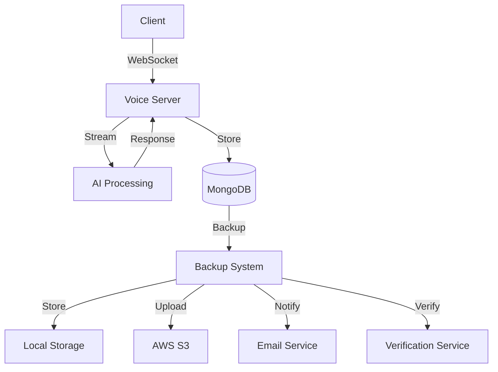
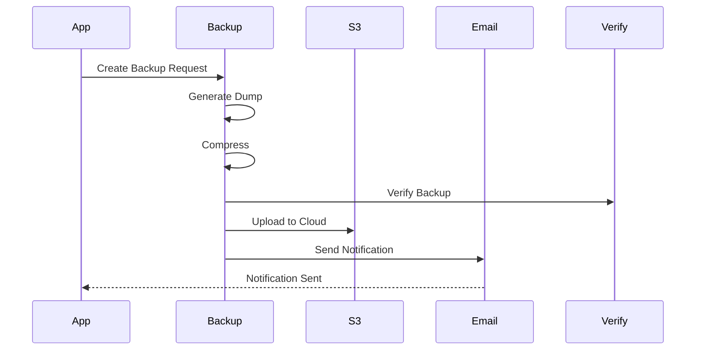

# Virtual Call Center

A modern virtual call center system with AI-powered voice processing capabilities. This system enables automated call handling, intelligent routing, and real-time voice processing using advanced AI technologies.

## Features

- **AI-Powered Voice Processing**: Leverages OpenAI's GPT models for natural language understanding and response generation
- **Real-time Voice Communication**: WebSocket-based voice streaming with Twilio integration
- **Secure Authentication**: JWT-based authentication with Google OAuth support
- **Database Management**: MongoDB with automated backup and restore capabilities
- **API Security**: Helmet and CORS protection
- **File Upload Support**: Multer integration for handling file uploads
- **Automated Database Backups**: Comprehensive backup system with:
  - Local and cloud storage (AWS S3)
  - Email notifications
  - Backup verification
  - Configurable retention policies
  - Detailed logging

## Architecture



## Prerequisites

- Node.js >= 18.0.0
- MongoDB >= 4.4
- AWS Account (for S3 backup storage)
- SMTP Server (for email notifications)
- Twilio Account (for voice processing)
- OpenAI API Key (for AI processing)

## Installation

1. Clone the repository:
```bash
git clone https://github.com/yourusername/VirtualCallCenter.git
cd VirtualCallCenter
```

2. Install dependencies:
```bash
npm install
```

3. Create a `.env` file in the root directory with the following variables:
```env
# MongoDB Configuration
MONGODB_URI=your_mongodb_uri

# AWS S3 Configuration
AWS_S3_ENABLED=true
AWS_S3_BUCKET=your_bucket_name
AWS_REGION=your_aws_region
AWS_ACCESS_KEY_ID=your_aws_access_key
AWS_SECRET_ACCESS_KEY=your_aws_secret_key

# Email Configuration
EMAIL_NOTIFICATIONS_ENABLED=true
SMTP_HOST=your_smtp_host
SMTP_PORT=587
SMTP_SECURE=false
SMTP_USER=your_smtp_user
SMTP_PASS=your_smtp_password
BACKUP_NOTIFICATION_EMAILS=recipient1@example.com,recipient2@example.com

# Logging Configuration
LOG_LEVEL=info

# OpenAI Configuration
OPENAI_API_KEY=your_openai_api_key
OPENAI_MODEL=gpt-4

# Twilio Configuration
TWILIO_ACCOUNT_SID=your_twilio_sid
TWILIO_AUTH_TOKEN=your_twilio_token
TWILIO_PHONE_NUMBER=your_twilio_number

# Other Configuration
PORT=3000
NODE_ENV=development
```

## Usage

### Starting the Server

Development mode:
```bash
npm run dev
```

Production mode:
```bash
npm start
```

### Database Management

Create a new migration:
```bash
npm run migrate:create
```

Apply migrations:
```bash
npm run migrate:up
```

Rollback migrations:
```bash
npm run migrate:down
```

Check migration status:
```bash
npm run migrate:status
```

### Backup Management

Create a backup:
```bash
npm run backup:create
```

Restore from a backup:
```bash
npm run backup:restore path/to/backup.zip
```

Verify a backup:
```bash
npm run backup:verify path/to/backup.zip
```

Clean up old backups:
```bash
npm run backup:cleanup
```

### Development Tools

Run tests:
```bash
npm test
```

Lint code:
```bash
npm run lint
```

Format code:
```bash
npm run format
```

## API Documentation

### Authentication Endpoints

#### POST /api/auth/login
Authenticate user and receive JWT token.

**Request Body:**
```json
{
  "email": "user@example.com",
  "password": "securepassword"
}
```

**Response:**
```json
{
  "token": "jwt_token",
  "user": {
    "id": "user_id",
    "email": "user@example.com",
    "role": "user"
  }
}
```

### Voice Processing Endpoints

#### POST /api/voice/start
Start a new voice session.

**Request Body:**
```json
{
  "phoneNumber": "+1234567890",
  "language": "en-US"
}
```

**Response:**
```json
{
  "sessionId": "session_id",
  "websocketUrl": "ws://server/voice/session_id"
}
```

#### WebSocket /voice/:sessionId
Real-time voice communication endpoint.

**Events:**
- `voice:start`: Start voice streaming
- `voice:data`: Voice data chunks
- `voice:end`: End voice session
- `ai:response`: AI-generated responses

### Backup Management Endpoints

#### POST /api/backup/create
Create a new database backup.

**Response:**
```json
{
  "backupId": "backup_id",
  "status": "completed",
  "size": 1234567,
  "checksum": "sha256_hash"
}
```

#### POST /api/backup/restore
Restore from a backup.

**Request Body:**
```json
{
  "backupId": "backup_id",
  "verify": true
}
```

## Backup System

The backup system provides comprehensive database backup capabilities:

### Features
- Automated MongoDB database dumps
- ZIP compression with configurable levels
- Local storage with retention policies
- AWS S3 cloud storage integration
- Email notifications for backup status
- Backup verification with checksums
- Detailed logging with rotation

### Configuration
Backup settings can be configured in `src/config/backup.js`:
- Local backup retention period
- S3 storage settings
- Email notification preferences
- Verification options
- Logging configuration

### Backup Process Flow


## Security

### Authentication & Authorization
- JWT-based authentication with refresh tokens
- Role-based access control (RBAC)
- OAuth 2.0 integration with Google
- Session management and timeout

### Data Protection
- All API endpoints are protected with JWT authentication
- CORS is enabled with configurable origins
- Helmet middleware provides additional security headers
- Sensitive data is stored in environment variables
- Database backups are encrypted and verified
- Rate limiting on API endpoints
- Input validation and sanitization

### Network Security
- HTTPS/TLS encryption
- WebSocket security with token validation
- IP whitelisting for admin endpoints
- Request size limits
- XSS protection

### Backup Security
- Encrypted backups with AES-256
- Secure S3 bucket policies
- Backup verification with checksums
- Access logging and audit trails
- Secure email notifications

## Troubleshooting

### Common Issues

1. **Backup Creation Fails**
   - Check MongoDB connection
   - Verify disk space
   - Check S3 credentials
   - Review error logs

2. **Voice Processing Issues**
   - Verify Twilio credentials
   - Check WebSocket connection
   - Monitor AI processing queue
   - Review voice quality settings

3. **Authentication Problems**
   - Verify JWT secret
   - Check token expiration
   - Validate OAuth credentials
   - Review user permissions

### Logging

Logs are stored in `logs/` directory:
- `app.log`: Application logs
- `backup.log`: Backup system logs
- `error.log`: Error logs
- `access.log`: Access logs

### Monitoring

The system provides monitoring endpoints:
- `/health`: System health check
- `/metrics`: Performance metrics
- `/status`: Service status

## Contributing

1. Fork the repository
2. Create your feature branch (`git checkout -b feature/amazing-feature`)
3. Commit your changes (`git commit -m 'Add some amazing feature'`)
4. Push to the branch (`git push origin feature/amazing-feature`)
5. Open a Pull Request

### Development Guidelines

- Follow ESLint configuration
- Write unit tests for new features
- Update documentation
- Follow semantic versioning
- Include changelog updates

## License

This project is licensed under the MIT License - see the LICENSE file for details.

## Support

For support, please:
1. Check the [documentation](docs/)
2. Search [existing issues](https://github.com/yourusername/VirtualCallCenter/issues)
3. Open a new issue with:
   - Detailed description
   - Steps to reproduce
   - Expected behavior
   - Environment details
   - Logs (if applicable)

## Changelog

See [CHANGELOG.md](CHANGELOG.md) for version history and changes.

## Deployment

### Production Deployment

#### 1. Server Requirements
- Ubuntu 20.04 LTS or later
- 4+ CPU cores
- 8GB+ RAM
- 100GB+ SSD storage
- Public IP address
- Domain name (recommended)

#### 2. System Setup
```bash
# Update system
sudo apt update && sudo apt upgrade -y

# Install Node.js
curl -fsSL https://deb.nodesource.com/setup_18.x | sudo -E bash -
sudo apt install -y nodejs

# Install MongoDB
wget -qO - https://www.mongodb.org/static/pgp/server-4.4.asc | sudo apt-key add -
echo "deb [ arch=amd64,arm64 ] https://repo.mongodb.org/apt/ubuntu focal/mongodb-org/4.4 multiverse" | sudo tee /etc/apt/sources.list.d/mongodb-org-4.4.list
sudo apt update
sudo apt install -y mongodb-org

# Install PM2
sudo npm install -g pm2

# Install Nginx
sudo apt install -y nginx
```

#### 3. Application Deployment
```bash
# Clone repository
git clone https://github.com/yourusername/VirtualCallCenter.git
cd VirtualCallCenter

# Install dependencies
npm install --production

# Create environment file
cp .env.example .env
# Edit .env with production values
nano .env

# Build application
npm run build

# Start with PM2
pm2 start ecosystem.config.js
pm2 save
pm2 startup
```

#### 4. Nginx Configuration
Create `/etc/nginx/sites-available/virtual-call-center`:
```nginx
server {
    listen 80;
    server_name your-domain.com;

    # Redirect HTTP to HTTPS
    return 301 https://$server_name$request_uri;
}

server {
    listen 443 ssl http2;
    server_name your-domain.com;

    # SSL configuration
    ssl_certificate /etc/letsencrypt/live/your-domain.com/fullchain.pem;
    ssl_certificate_key /etc/letsencrypt/live/your-domain.com/privkey.pem;
    ssl_session_timeout 1d;
    ssl_session_cache shared:SSL:50m;
    ssl_session_tickets off;
    ssl_protocols TLSv1.2 TLSv1.3;
    ssl_ciphers ECDHE-ECDSA-AES128-GCM-SHA256:ECDHE-RSA-AES128-GCM-SHA256:ECDHE-ECDSA-AES256-GCM-SHA384:ECDHE-RSA-AES256-GCM-SHA384:ECDHE-ECDSA-CHACHA20-POLY1305:ECDHE-RSA-CHACHA20-POLY1305:DHE-RSA-AES128-GCM-SHA256:DHE-RSA-AES256-GCM-SHA384;
    ssl_prefer_server_ciphers off;

    # HSTS
    add_header Strict-Transport-Security "max-age=63072000" always;

    # Root directory
    root /var/www/virtual-call-center/public;

    # Proxy settings
    location / {
        proxy_pass http://localhost:3000;
        proxy_http_version 1.1;
        proxy_set_header Upgrade $http_upgrade;
        proxy_set_header Connection 'upgrade';
        proxy_set_header Host $host;
        proxy_cache_bypass $http_upgrade;
        proxy_set_header X-Real-IP $remote_addr;
        proxy_set_header X-Forwarded-For $proxy_add_x_forwarded_for;
        proxy_set_header X-Forwarded-Proto $scheme;
    }

    # WebSocket support
    location /socket.io/ {
        proxy_pass http://localhost:3000;
        proxy_http_version 1.1;
        proxy_set_header Upgrade $http_upgrade;
        proxy_set_header Connection "Upgrade";
        proxy_set_header Host $host;
        proxy_cache_bypass $http_upgrade;
    }

    # Static files
    location /static/ {
        expires 1y;
        add_header Cache-Control "public, no-transform";
    }
}
```

Enable the site:
```bash
sudo ln -s /etc/nginx/sites-available/virtual-call-center /etc/nginx/sites-enabled/
sudo nginx -t
sudo systemctl restart nginx
```

#### 5. SSL Configuration
```bash
# Install Certbot
sudo apt install -y certbot python3-certbot-nginx

# Get SSL certificate
sudo certbot --nginx -d your-domain.com
```

#### 6. Firewall Configuration
```bash
# Configure UFW
sudo ufw allow 22
sudo ufw allow 80
sudo ufw allow 443
sudo ufw enable
```

#### 7. Monitoring Setup
```bash
# Install monitoring tools
pm2 install pm2-logrotate
pm2 set pm2-logrotate:max_size 10M
pm2 set pm2-logrotate:retain 7
pm2 set pm2-logrotate:compress true

# Setup monitoring dashboard
pm2 install pm2-logrotate
pm2 set pm2-logrotate:max_size 10M
pm2 set pm2-logrotate:retain 7
pm2 set pm2-logrotate:compress true
```

### Docker Deployment

#### 1. Build Docker Image
```bash
# Build image
docker build -t virtual-call-center .

# Run container
docker run -d \
  --name virtual-call-center \
  -p 3000:3000 \
  --env-file .env \
  --restart unless-stopped \
  virtual-call-center
```

#### 2. Docker Compose
Create `docker-compose.yml`:
```yaml
version: '3.8'

services:
  app:
    build: .
    ports:
      - "3000:3000"
    env_file:
      - .env
    depends_on:
      - mongodb
    restart: unless-stopped

  mongodb:
    image: mongo:4.4
    volumes:
      - mongodb_data:/data/db
    environment:
      - MONGO_INITDB_ROOT_USERNAME=admin
      - MONGO_INITDB_ROOT_PASSWORD=your_secure_password
    restart: unless-stopped

  nginx:
    image: nginx:alpine
    ports:
      - "80:80"
      - "443:443"
    volumes:
      - ./nginx.conf:/etc/nginx/conf.d/default.conf
      - ./ssl:/etc/nginx/ssl
    depends_on:
      - app
    restart: unless-stopped

volumes:
  mongodb_data:
```

Run with Docker Compose:
```bash
docker-compose up -d
```

### Deployment Checklist

#### Pre-deployment
- [ ] Update all dependencies
- [ ] Run tests
- [ ] Check environment variables
- [ ] Backup database
- [ ] Update documentation

#### Deployment
- [ ] Deploy to staging environment
- [ ] Run integration tests
- [ ] Verify backup system
- [ ] Check monitoring
- [ ] Deploy to production

#### Post-deployment
- [ ] Verify all services
- [ ] Check logs for errors
- [ ] Monitor performance
- [ ] Update changelog
- [ ] Tag release

### Scaling Considerations

#### Horizontal Scaling
- Use load balancer (e.g., AWS ELB)
- Configure sticky sessions for WebSocket
- Implement Redis for session storage
- Use MongoDB replica sets

#### Vertical Scaling
- Monitor resource usage
- Set up auto-scaling groups
- Configure database sharding
- Implement caching

#### Performance Optimization
- Enable compression
- Configure CDN
- Implement rate limiting
- Use connection pooling

### Azure Deployment

#### 1. Prerequisites
- Azure subscription
- Azure CLI installed
- Azure Container Registry (ACR)
- Azure Kubernetes Service (AKS)
- Azure Database for MongoDB
- Azure Key Vault
- Azure Application Insights

#### 2. Azure Infrastructure Setup

```bash
# Login to Azure
az login

# Create resource group
az group create --name virtual-call-center --location eastus

# Create Azure Container Registry
az acr create --resource-group virtual-call-center \
    --name virtualcallcenter \
    --sku Basic \
    --admin-enabled true

# Create Azure Database for MongoDB
az cosmosdb create \
    --name virtual-call-center-db \
    --resource-group virtual-call-center \
    --kind MongoDB \
    --default-consistency-level Eventual \
    --locations regionName=eastus

# Create Azure Key Vault
az keyvault create \
    --name virtual-call-center-kv \
    --resource-group virtual-call-center \
    --location eastus \
    --enabled-for-disk-encryption true \
    --enabled-for-deployment true \
    --enabled-for-template-deployment true \
    --sku standard

# Create Application Insights
az monitor app-insights component create \
    --app virtual-call-center \
    --location eastus \
    --resource-group virtual-call-center
```

#### 3. Store Secrets in Key Vault

```bash
# Store MongoDB connection string
az keyvault secret set \
    --vault-name virtual-call-center-kv \
    --name mongodb-connection-string \
    --value "your_mongodb_connection_string"

# Store OpenAI API key
az keyvault secret set \
    --vault-name virtual-call-center-kv \
    --name openai-api-key \
    --value "your_openai_api_key"

# Store Twilio credentials
az keyvault secret set \
    --vault-name virtual-call-center-kv \
    --name twilio-credentials \
    --value "your_twilio_credentials"
```

#### 4. Create AKS Cluster

```bash
# Create AKS cluster
az aks create \
    --resource-group virtual-call-center \
    --name virtual-call-center-aks \
    --node-count 3 \
    --enable-addons monitoring \
    --generate-ssh-keys \
    --attach-acr virtualcallcenter

# Get credentials
az aks get-credentials \
    --resource-group virtual-call-center \
    --name virtual-call-center-aks
```

#### 5. Deploy Application

Create `azure-pipelines.yml`:
```yaml
trigger:
  - main

pool:
  vmImage: 'ubuntu-latest'

variables:
  dockerRegistryServiceConnection: 'virtualcallcenter'
  imageRepository: 'virtual-call-center'
  dockerfilePath: 'Dockerfile'
  tag: '$(Build.BuildId)'
  azureSubscription: 'virtual-call-center'
  resourceGroupName: 'virtual-call-center'
  containerRegistry: 'virtualcallcenter'
  dockerRegistryServiceConnection: 'virtualcallcenter'
  aksClusterName: 'virtual-call-center-aks'
  namespace: 'virtual-call-center'

stages:
- stage: Build
  displayName: Build and push stage
  jobs:
  - job: Build
    displayName: Build
    pool:
      vmImage: 'ubuntu-latest'
    steps:
    - task: Docker@2
      inputs:
        command: buildAndPush
        repository: $(imageRepository)
        dockerfile: $(dockerfilePath)
        containerRegistry: $(dockerRegistryServiceConnection)
        tags: |
          $(tag)
          latest

- stage: Deploy
  displayName: Deploy stage
  dependsOn: Build
  condition: succeeded()
  jobs:
  - deployment: Deploy
    displayName: Deploy
    pool:
      vmImage: 'ubuntu-latest'
    environment: 'virtual-call-center'
    strategy:
      runOnce:
        deploy:
          steps:
          - task: KubernetesManifest@0
            inputs:
              action: deploy
              kubernetesServiceConnection: $(azureSubscription)
              namespace: $(namespace)
              manifests: |
                $(Pipeline.Workspace)/manifests/*
              containers: |
                $(containerRegistry)/$(imageRepository):$(tag)
```

Create Kubernetes manifests:

`deployment.yaml`:
```yaml
apiVersion: apps/v1
kind: Deployment
metadata:
  name: virtual-call-center
spec:
  replicas: 3
  selector:
    matchLabels:
      app: virtual-call-center
  template:
    metadata:
      labels:
        app: virtual-call-center
    spec:
      containers:
      - name: virtual-call-center
        image: virtualcallcenter.azurecr.io/virtual-call-center:latest
        ports:
        - containerPort: 3000
        env:
        - name: MONGODB_URI
          valueFrom:
            secretKeyRef:
              name: mongodb-secrets
              key: connection-string
        - name: OPENAI_API_KEY
          valueFrom:
            secretKeyRef:
              name: openai-secrets
              key: api-key
        resources:
          requests:
            cpu: 500m
            memory: 512Mi
          limits:
            cpu: 1000m
            memory: 1Gi
        livenessProbe:
          httpGet:
            path: /health
            port: 3000
          initialDelaySeconds: 30
          periodSeconds: 10
        readinessProbe:
          httpGet:
            path: /ready
            port: 3000
          initialDelaySeconds: 5
          periodSeconds: 5
```

`service.yaml`:
```yaml
apiVersion: v1
kind: Service
metadata:
  name: virtual-call-center
spec:
  type: LoadBalancer
  ports:
  - port: 80
    targetPort: 3000
  selector:
    app: virtual-call-center
```

`ingress.yaml`:
```yaml
apiVersion: networking.k8s.io/v1
kind: Ingress
metadata:
  name: virtual-call-center
  annotations:
    kubernetes.io/ingress.class: nginx
    cert-manager.io/cluster-issuer: letsencrypt-prod
spec:
  tls:
  - hosts:
    - your-domain.com
    secretName: virtual-call-center-tls
  rules:
  - host: your-domain.com
    http:
      paths:
      - path: /
        pathType: Prefix
        backend:
          service:
            name: virtual-call-center
            port:
              number: 80
```

#### 6. Deploy to AKS

```bash
# Create namespace
kubectl create namespace virtual-call-center

# Apply secrets
kubectl create secret generic mongodb-secrets \
    --from-literal=connection-string="your_mongodb_connection_string" \
    -n virtual-call-center

kubectl create secret generic openai-secrets \
    --from-literal=api-key="your_openai_api_key" \
    -n virtual-call-center

# Apply manifests
kubectl apply -f deployment.yaml -n virtual-call-center
kubectl apply -f service.yaml -n virtual-call-center
kubectl apply -f ingress.yaml -n virtual-call-center
```

#### 7. Monitoring Setup

```bash
# Enable Application Insights
az aks enable-addons \
    --addons monitoring \
    --name virtual-call-center-aks \
    --resource-group virtual-call-center

# Configure log analytics
az monitor log-analytics workspace create \
    --resource-group virtual-call-center \
    --workspace-name virtual-call-center-logs
```

#### 8. Backup Configuration

```bash
# Create Azure Storage Account for backups
az storage account create \
    --name virtualcallcenterbackup \
    --resource-group virtual-call-center \
    --location eastus \
    --sku Standard_LRS

# Configure backup policy
az backup vault create \
    --resource-group virtual-call-center \
    --name virtual-call-center-backup-vault \
    --location eastus
```

#### 9. Auto-scaling Configuration

```bash
# Enable cluster autoscaler
az aks update \
    --resource-group virtual-call-center \
    --name virtual-call-center-aks \
    --enable-cluster-autoscaler \
    --min-count 3 \
    --max-count 10

# Configure pod autoscaling
kubectl autoscale deployment virtual-call-center \
    --cpu-percent=70 \
    --min=3 \
    --max=10 \
    -n virtual-call-center
```

#### 10. Azure DevOps Pipeline Setup

1. Create new pipeline in Azure DevOps
2. Connect to GitHub repository
3. Select `azure-pipelines.yml`
4. Configure service connections:
   - Azure subscription
   - Container registry
   - Kubernetes cluster

#### 11. Disaster Recovery

1. **Database Backup**
   - Configure point-in-time recovery
   - Set up geo-replication
   - Regular backup testing

2. **Application Recovery**
   - Multi-region deployment
   - Traffic manager configuration
   - Failover testing

3. **Monitoring and Alerts**
   - Set up Azure Monitor alerts
   - Configure Application Insights
   - Implement health checks

#### 12. Azure AD Integration

```bash
# Create Azure AD Application
az ad app create \
    --display-name "Virtual Call Center" \
    --web-redirect-uris "https://your-domain.com/auth/callback" \
    --enable-id-token-issuance true

# Create Service Principal
az ad sp create-for-rbac \
    --name "virtual-call-center-sp" \
    --role contributor \
    --scopes /subscriptions/$(az account show --query id -o tsv)/resourceGroups/virtual-call-center

# Configure AKS with Azure AD
az aks update \
    --resource-group virtual-call-center \
    --name virtual-call-center-aks \
    --enable-aad \
    --enable-azure-rbac

# Create RBAC roles
kubectl create clusterrolebinding virtual-call-center-admin \
    --clusterrole=cluster-admin \
    --group=virtual-call-center-admins
```

Create `aad-pod-identity.yaml`:
```yaml
apiVersion: aadpodidentity.k8s.io/v1
kind: AzureIdentity
metadata:
  name: virtual-call-center-identity
spec:
  type: 0
  resourceID: /subscriptions/$(SUBSCRIPTION_ID)/resourceGroups/virtual-call-center/providers/Microsoft.ManagedIdentity/userAssignedIdentities/virtual-call-center-identity
  clientID: $(CLIENT_ID)
---
apiVersion: aadpodidentity.k8s.io/v1
kind: AzureIdentityBinding
metadata:
  name: virtual-call-center-binding
spec:
  azureIdentity: virtual-call-center-identity
  selector: virtual-call-center
```

#### 13. Azure CDN Setup

```bash
# Create CDN Profile
az cdn profile create \
    --name virtual-call-center-cdn \
    --resource-group virtual-call-center \
    --sku Standard_Microsoft

# Create CDN Endpoint
az cdn endpoint create \
    --name virtual-call-center-endpoint \
    --profile-name virtual-call-center-cdn \
    --resource-group virtual-call-center \
    --origin your-domain.com \
    --origin-host-header your-domain.com \
    --enable-compression true \
    --query-string-caching-behavior IgnoreQueryString

# Configure Custom Domain
az cdn custom-domain create \
    --endpoint-name virtual-call-center-endpoint \
    --profile-name virtual-call-center-cdn \
    --resource-group virtual-call-center \
    --hostname cdn.your-domain.com \
    --certificate-type ManagedCertificate
```

#### 14. Azure Front Door Configuration

```bash
# Create Front Door Profile
az network front-door create \
    --name virtual-call-center-frontdoor \
    --resource-group virtual-call-center \
    --accepted-protocols Http Https \
    --backend-address your-domain.com \
    --forwarding-protocol HttpsOnly \
    --enabled true

# Configure Health Probes
az network front-door probe create \
    --front-door-name virtual-call-center-frontdoor \
    --resource-group virtual-call-center \
    --name healthprobe \
    --path /health \
    --protocol Https \
    --interval 30 \
    --timeout 5 \
    --threshold 3

# Configure Routing Rules
az network front-door routing-rule create \
    --front-door-name virtual-call-center-frontdoor \
    --resource-group virtual-call-center \
    --name routingrule \
    --accepted-protocols Http Https \
    --patterns "/*" \
    --forwarding-protocol HttpsOnly \
    --backend-pool-name backendpool \
    --probe-name healthprobe
```

Create `frontdoor-rules.yaml`:
```yaml
apiVersion: networking.k8s.io/v1
kind: Ingress
metadata:
  name: virtual-call-center-frontdoor
  annotations:
    kubernetes.io/ingress.class: azure-front-door
    azure-front-door/backend-protocol: https
    azure-front-door/health-probe-path: /health
    azure-front-door/health-probe-interval: 30
    azure-front-door/health-probe-timeout: 5
    azure-front-door/health-probe-threshold: 3
spec:
  rules:
  - host: your-domain.com
    http:
      paths:
      - path: /
        pathType: Prefix
        backend:
          service:
            name: virtual-call-center
            port:
              number: 80
```

#### 15. Azure WAF Configuration

```bash
# Create WAF Policy
az network application-gateway waf-policy create \
    --name virtual-call-center-waf \
    --resource-group virtual-call-center \
    --location eastus \
    --type OWASP \
    --version 3.2 \
    --disabled-rules 942200 942130 \
    --file-upload-limit-waf 100 \
    --request-body-check true \
    --max-request-body-size 128 \
    --request-body-inspect-limit 128

# Configure WAF Rules
az network application-gateway waf-policy rule create \
    --policy-name virtual-call-center-waf \
    --resource-group virtual-call-center \
    --name block-bad-bots \
    --rule-type MatchRule \
    --priority 100 \
    --action Block \
    --match-conditions "[{\"matchVariable\":\"RequestHeaders\",\"selector\":\"User-Agent\",\"operator\":\"Contains\",\"negationCond\":false,\"matchValue\":[\"bad-bot\",\"scraper\"],\"transforms\":[]}]"

# Enable WAF on Front Door
az network front-door waf-policy set \
    --front-door-name virtual-call-center-frontdoor \
    --resource-group virtual-call-center \
    --policy-name virtual-call-center-waf
```

Create `waf-rules.yaml`:
```yaml
apiVersion: networking.k8s.io/v1
kind: Ingress
metadata:
  name: virtual-call-center-waf
  annotations:
    kubernetes.io/ingress.class: azure-application-gateway
    appgw.ingress.kubernetes.io/waf-policy: virtual-call-center-waf
    appgw.ingress.kubernetes.io/ssl-redirect: "true"
    appgw.ingress.kubernetes.io/connection-draining: "true"
    appgw.ingress.kubernetes.io/connection-draining-timeout: "30"
spec:
  rules:
  - host: your-domain.com
    http:
      paths:
      - path: /
        pathType: Prefix
        backend:
          service:
            name: virtual-call-center
            port:
              number: 80
```

#### 16. Azure DDoS Protection

```bash
# Create DDoS Protection Plan
az network ddos-protection create \
    --name virtual-call-center-ddos \
    --resource-group virtual-call-center \
    --location eastus

# Enable DDoS Protection on Virtual Network
az network vnet update \
    --name virtual-call-center-vnet \
    --resource-group virtual-call-center \
    --ddos-protection-plan virtual-call-center-ddos
```

#### 17. Azure Private Link

```bash
# Create Private Link Service
az network private-link-service create \
    --name virtual-call-center-pls \
    --resource-group virtual-call-center \
    --vnet-name virtual-call-center-vnet \
    --subnet virtual-call-center-subnet \
    --lb-name virtual-call-center-lb \
    --lb-frontend-ip-configs virtual-call-center-frontend-ip \
    --private-ip-address 10.0.0.4

# Configure Private Endpoint
az network private-endpoint create \
    --name virtual-call-center-pe \
    --resource-group virtual-call-center \
    --vnet-name virtual-call-center-vnet \
    --subnet virtual-call-center-subnet \
    --private-connection-resource-id /subscriptions/$(SUBSCRIPTION_ID)/resourceGroups/virtual-call-center/providers/Microsoft.Network/privateLinkServices/virtual-call-center-pls
```

#### 18. Azure Monitor Integration

```bash
# Create Log Analytics Workspace
az monitor log-analytics workspace create \
    --resource-group virtual-call-center \
    --workspace-name virtual-call-center-logs \
    --location eastus

# Configure Diagnostic Settings
az monitor diagnostic-settings create \
    --name virtual-call-center-diagnostics \
    --resource /subscriptions/$(SUBSCRIPTION_ID)/resourceGroups/virtual-call-center/providers/Microsoft.ContainerService/managedClusters/virtual-call-center-aks \
    --workspace virtual-call-center-logs \
    --logs '[{"category": "kube-audit","enabled": true},{"category": "kube-audit-admin","enabled": true},{"category": "guard","enabled": true}]'

# Set up Alerts
az monitor metrics alert create \
    --name virtual-call-center-cpu-alert \
    --resource-group virtual-call-center \
    --scopes /subscriptions/$(SUBSCRIPTION_ID)/resourceGroups/virtual-call-center/providers/Microsoft.ContainerService/managedClusters/virtual-call-center-aks \
    --condition "avg cpu percentage > 80" \
    --window-size 5m \
    --evaluation-frequency 1m
```
